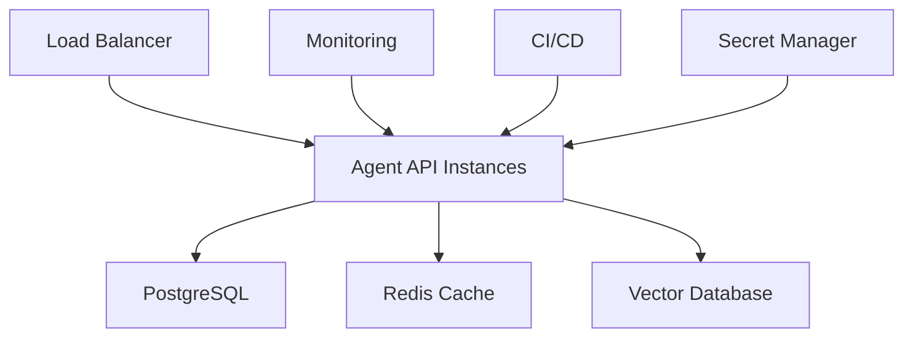

# 🚀 Module 5: Déploiement Production

## 🎯 Objectifs d'Apprentissage (2h)

À la fin de ce module, vos agents seront **production-ready** :
- ✅ **Containerisation Docker** pour tous environnements
- ✅ **APIs REST FastAPI** professionnelles
- ✅ **Monitoring & Observabilité** pour la supervision
- ✅ **CI/CD Pipeline** pour le déploiement automatisé

## 📂 Structure du Module

```
05-deployment/
├── README.md              # Ce guide
├── docker/
│   ├── Dockerfile         # Image de base optimisée
│   ├── docker-compose.yml # Stack complète
│   └── deploy-script.py   # Script de déploiement
├── monitoring/
│   ├── metrics-setup.py   # Métriques Prometheus
│   ├── logging-config.py  # Logs structurés
│   └── healthcheck.py     # Health endpoints
└── ci-cd/
    ├── github-actions.yml # Pipeline CI/CD
    ├── deploy-heroku.py   # Déploiement Heroku
    └── deploy-railway.py  # Déploiement Railway
```

## 🐳 Docker: Containerisation

**Pourquoi Docker** :
- ✅ Environnement reproductible
- ✅ Déploiement uniforme (dev/staging/prod)
- ✅ Scalabilité horizontale
- ✅ Isolation des dépendances

**Stack recommandée** :
- **Base**: Python 3.11-slim
- **Web**: FastAPI + Uvicorn
- **Database**: PostgreSQL + Redis (optionnel)
- **Monitoring**: Prometheus + Grafana

## 📊 Monitoring: Observabilité

**Métriques Essentielles** :
- **Performance**: Latence, throughput, erreurs
- **Business**: Tâches complétées, satisfaction utilisateur
- **Infrastructure**: CPU, mémoire, réseau
- **Agents**: Confiance, outils utilisés, escalations

**Alerting** :
- Latence > 5s
- Taux d'erreur > 5%
- Agents en échec
- Resources critiques

## ⚙️ CI/CD: Déploiement Automatisé

**Pipeline Standard** :
1. **Code Push** → GitHub
2. **Tests** → Automated testing
3. **Build** → Docker image
4. **Deploy** → Staging → Production
5. **Monitor** → Health checks

**Plateformes Supportées** :
- **Heroku** : Simple, idéal pour MVP
- **Railway** : Moderne, PostgreSQL inclus
- **Google Cloud Run** : Serverless, scalable
- **AWS ECS** : Enterprise, complex

## 🛡️ Sécurité Production

**Essentials** :
- ✅ Variables d'environnement (pas de secrets hardcodés)
- ✅ API Keys rotation
- ✅ Rate limiting sur endpoints
- ✅ Input validation stricte
- ✅ HTTPS obligatoire
- ✅ Logs sanitizés (pas de secrets)

## 📈 Performance Optimization

**Stratégies** :
- **Async/Await** pour I/O non-bloquant
- **Connection pooling** pour databases
- **Caching** Redis pour réponses fréquentes
- **Load balancing** pour haute disponibilité
- **Horizontal scaling** avec Docker Swarm/K8s

## 💰 Coûts Optimisation

**Tiers Gratuits** :
- **Heroku** : 550h/mois (sleep après 30min)
- **Railway** : $5/mois, puis usage
- **Vercel** : Fonctions serverless gratuites
- **Supabase** : PostgreSQL gratuit 500MB

**Estimation Coûts** :
- **MVP** : $0-10/mois (tiers gratuits)
- **Startup** : $20-50/mois (Railway + monitoring)
- **Scale** : $100-500/mois (cloud dédié)

## 🎓 Exercices Pratiques

### **Exercice 1: Dockerisation (30min)**
- Containériser votre agent portfolio
- Multi-stage build pour optimiser taille
- Variables d'environnement sécurisées

### **Exercice 2: FastAPI Production (45min)**
- Endpoints REST pour votre agent
- Swagger documentation automatique
- Rate limiting et validation

### **Exercice 3: Monitoring Setup (30min)**
- Métriques Prometheus custom
- Health check endpoints
- Logging structuré JSON

### **Exercice 4: Déploiement Live (45min)**
- Deploy sur Railway/Heroku
- Configuration domaine custom
- Pipeline CI/CD fonctionnel

## ✅ Validation Production-Ready

Votre agent est prêt pour la production si :
- [ ] **Tests** passent en CI/CD
- [ ] **Docker** build sans erreur
- [ ] **Health checks** répondent < 1s
- [ ] **Monitoring** capture métriques business
- [ ] **Secrets** gérés via environnement
- [ ] **APIs** documentées (Swagger)
- [ ] **Rate limiting** configuré
- [ ] **Logs** structurés et propres
- [ ] **Déploiement** automatisé
- [ ] **Rollback** possible en 1-click

## 🌟 Architecture Production Type



**Composants** :
- **Load Balancer** : Distribution requêtes
- **Agent Instances** : Vos agents dockerisés
- **PostgreSQL** : Données persistantes
- **Redis** : Cache et sessions
- **Vector DB** : Embeddings (Pinecone/Weaviate)
- **Monitoring** : Prometheus + Grafana
- **Secrets** : Variables d'environnement sécurisées

---

💡 **Production Philosophy**: "If it's not monitored, it doesn't exist in production. If it can't be deployed in 1-click, it's not ready."